# Security Suite Control Panel

<p align="center">
  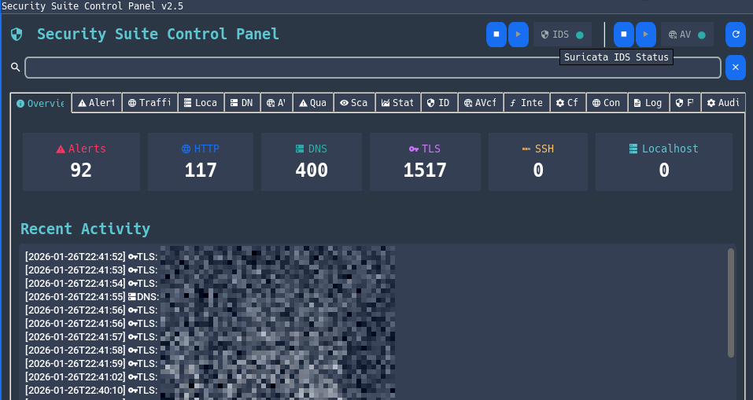
</p>

<p align="center">
  <strong>A unified security monitoring and management dashboard for Linux systems</strong>
</p>

<p align="center">
  <a href="#features">Features</a> •
  <a href="#installation">Installation</a> •
  <a href="#usage">Usage</a> •
  <a href="#threat-intelligence">Threat Intelligence</a> •
  <a href="#configuration">Configuration</a>
</p>

---

## Overview

Security Suite Control Panel is a comprehensive desktop application that integrates **Intrusion Detection Systems (Suricata/Snort)**, **ClamAV Antivirus**, **Firewall Management**, and **Threat Intelligence** into a single, intuitive interface. Monitor your network traffic, detect threats, and harden your system—all from one dashboard.

**Only tested on Fedora so far**

### Key Highlights

- **Real-time Network Monitoring** — Track HTTP, DNS, TLS, and SSH traffic with live activity feeds
- **Dual IDS Support** — Native integration with both Suricata and Snort engines
- **ClamAV Integration** — Full antivirus control with on-access scanning and scheduled updates
- **Threat Intelligence** — Automatic IP/domain enrichment via VirusTotal, AbuseIPDB, AlienVault OTX, and ThreatFox
- **Security Auditing** — System hardening checks with actionable recommendations
- **Modern UI** — Dark-themed interface with tabbed navigation and real-time updates

---

## Features

### Real-time Security Dashboard

<p align="center">
  
</p>

The **Overview** tab provides at-a-glance metrics including:
- Active alert count with severity breakdown
- Protocol statistics (HTTP, DNS, TLS, SSH)
- Live activity feed showing recent network events
- Service status indicators for IDS and AV engines

---

### Alert Management

<p align="center">
  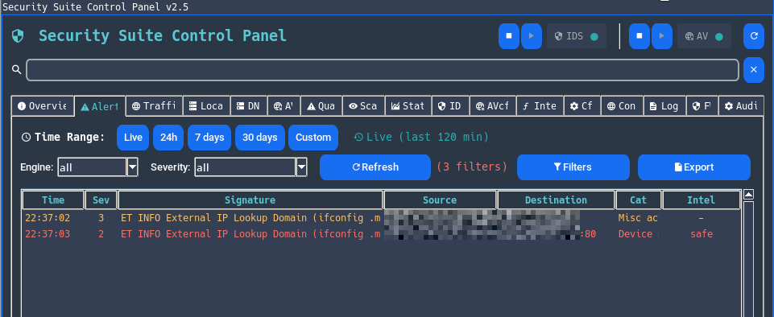
</p>

Powerful alert filtering and analysis:
- **Time Range Filters** — Live, 24h, 7 days, 30 days, or custom ranges
- **Engine Selection** — Filter by Suricata, Snort, or all engines
- **Severity Filtering** — Focus on critical, high, medium, or low priority alerts
- **Intel Enrichment** — Automatic threat intelligence lookups for source/destination IPs
- **Export Capabilities** — Export alerts for further analysis

---

### Network Traffic Analysis

<p align="center">
  
</p>

Deep visibility into network connections:
- Protocol-based filtering (HTTP, TLS, DNS, etc.)
- JA3/JA4 TLS fingerprinting for malware detection
- Host/SNI tracking for encrypted traffic analysis
- Connection grouping and aggregation
- Source and destination tracking

---

### DNS Query Analysis

<p align="center">
  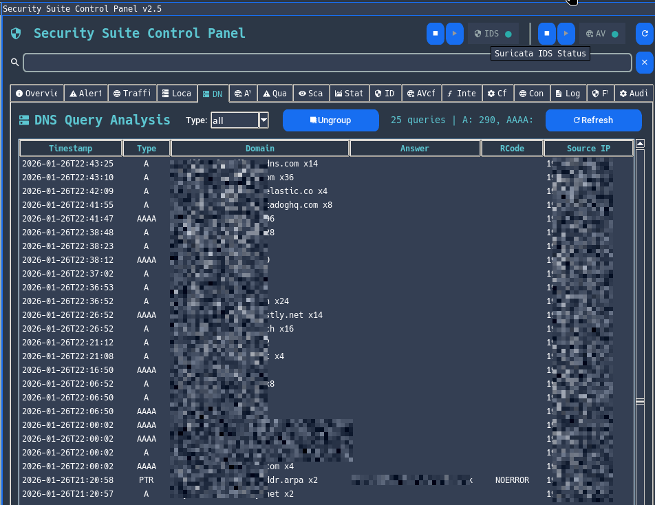
</p>

Monitor all DNS activity:
- Query type filtering (A, AAAA, PTR, CNAME, etc.)
- Domain grouping with query counts
- Response code tracking
- Source IP attribution
- Real-time query logging

---

### Local Network Monitoring

<p align="center">
  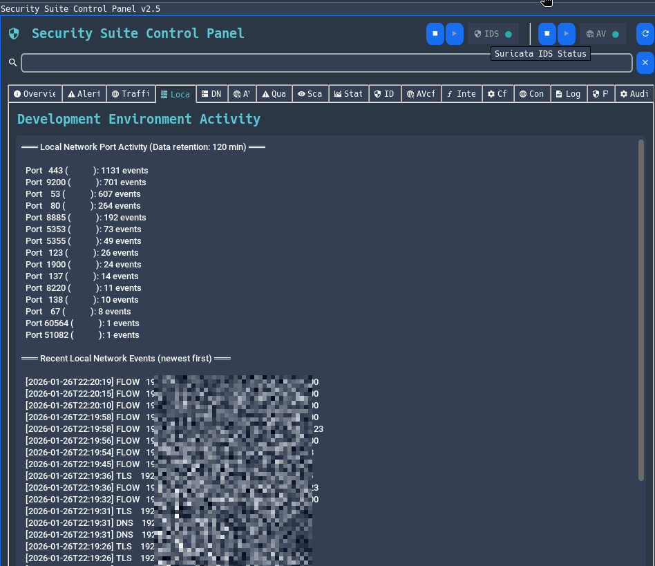
</p>

Track local network behavior:
- Port activity summary with event counts
- Development environment awareness
- Flow-level event logging
- Data retention controls

---

### ClamAV Antivirus Control

<p align="center">
  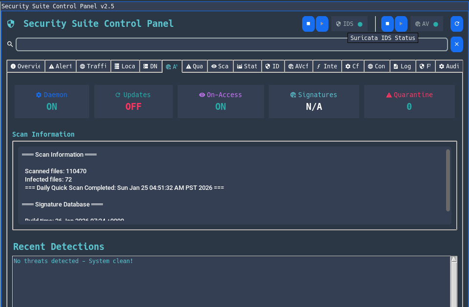
</p>

Complete antivirus management:
- **Daemon Control** — Start, stop, restart ClamD
- **Signature Updates** — 3.6M+ signatures with configurable update frequency
- **On-Access Scanning** — Real-time file protection for `/home`, `/tmp`, and more
- **Scan Statistics** — Track scanned files and detections
- **Quarantine Management** — Review and manage detected threats

<p align="center">
  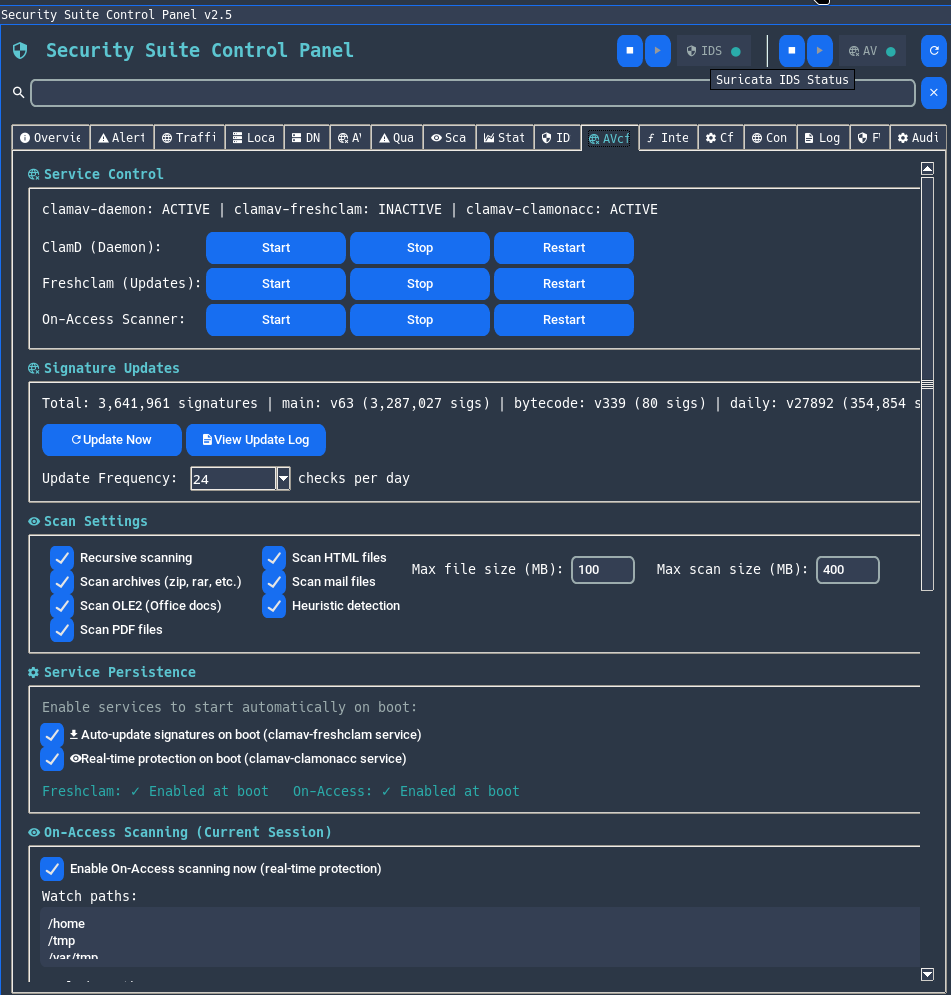
</p>

Advanced scan settings:
- Archive scanning (zip, rar, etc.)
- Office document scanning (OLE2)
- PDF and HTML file scanning
- Heuristic detection
- Max file/scan size limits
- Service persistence configuration

---

### IDS Configuration

<p align="center">
  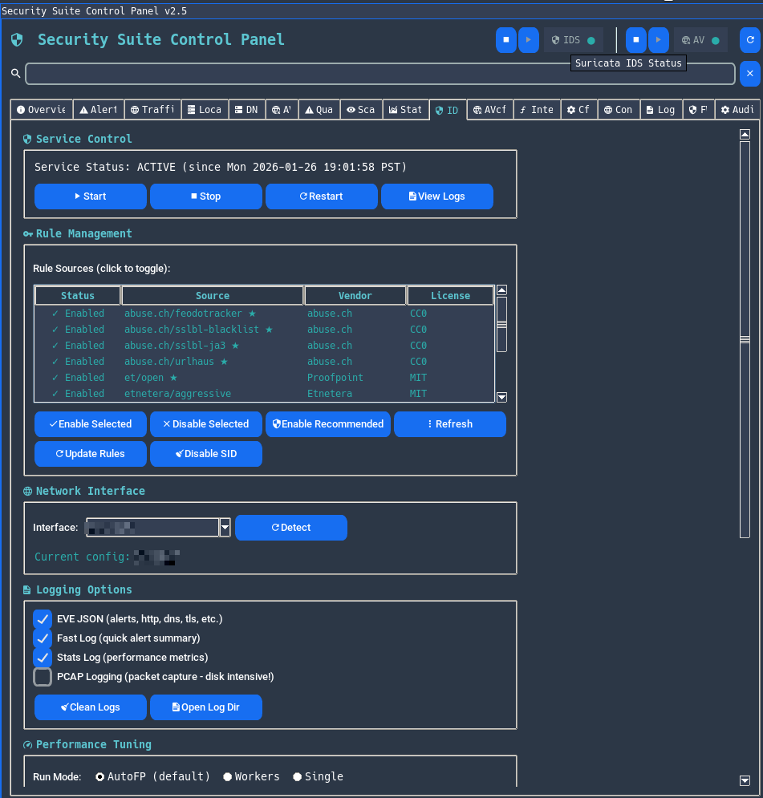
</p>

Full Suricata/Snort configuration:
- **Service Control** — Start, stop, restart with status display
- **Rule Management** — Enable/disable rule sources (ET Open, abuse.ch, etc.)
- **Network Interface** — Auto-detect and configure monitoring interface
- **Logging Options** — EVE JSON, Fast Log, Stats, PCAP capture
- **Performance Tuning** — AutoFP, Workers, or Single run modes
- **JA3/JA4 Fingerprinting** — Enable TLS fingerprint detection

<p align="center">
  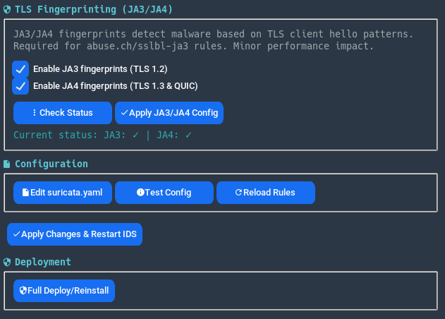
</p>

- Configuration file editing
- Config validation
- Rule reload without restart
- Full deployment/reinstall option

---

### Threat Intelligence Integration

<p align="center">
  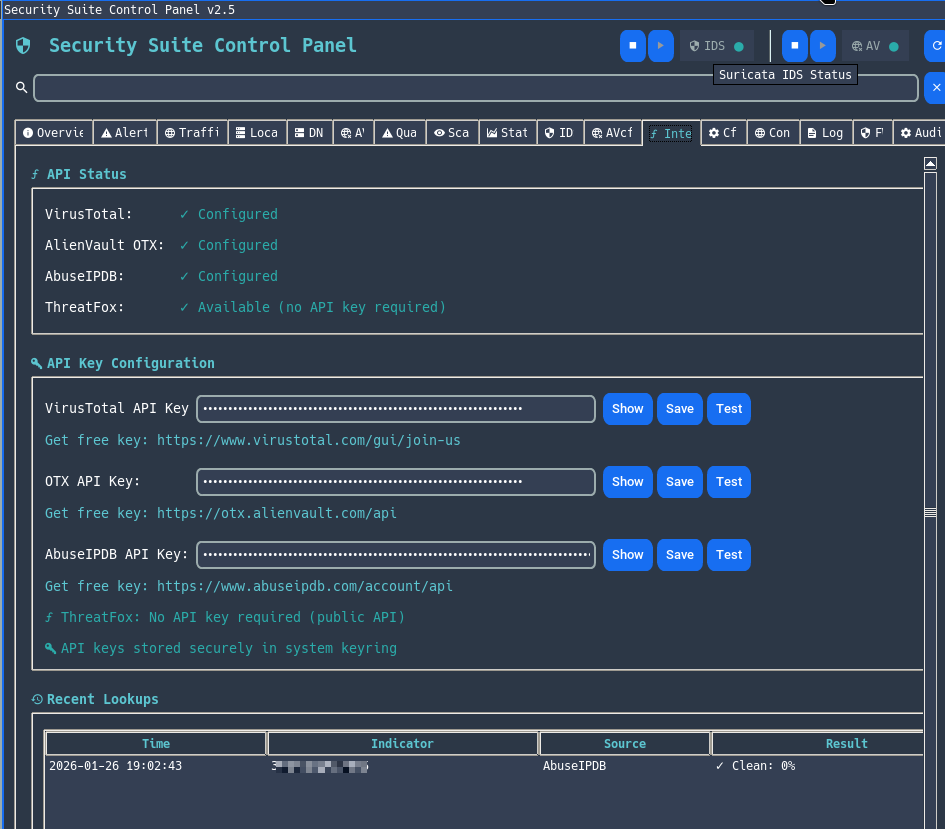
</p>

Enrich alerts with external threat data:
- **VirusTotal** — File and IP reputation checks
- **AlienVault OTX** — Pulse-based threat intelligence
- **AbuseIPDB** — IP reputation and abuse reports
- **ThreatFox** — IOC database from abuse.ch
- Secure API key storage in system keyring
- Recent lookup history

---

### Firewall Management

<p align="center">
  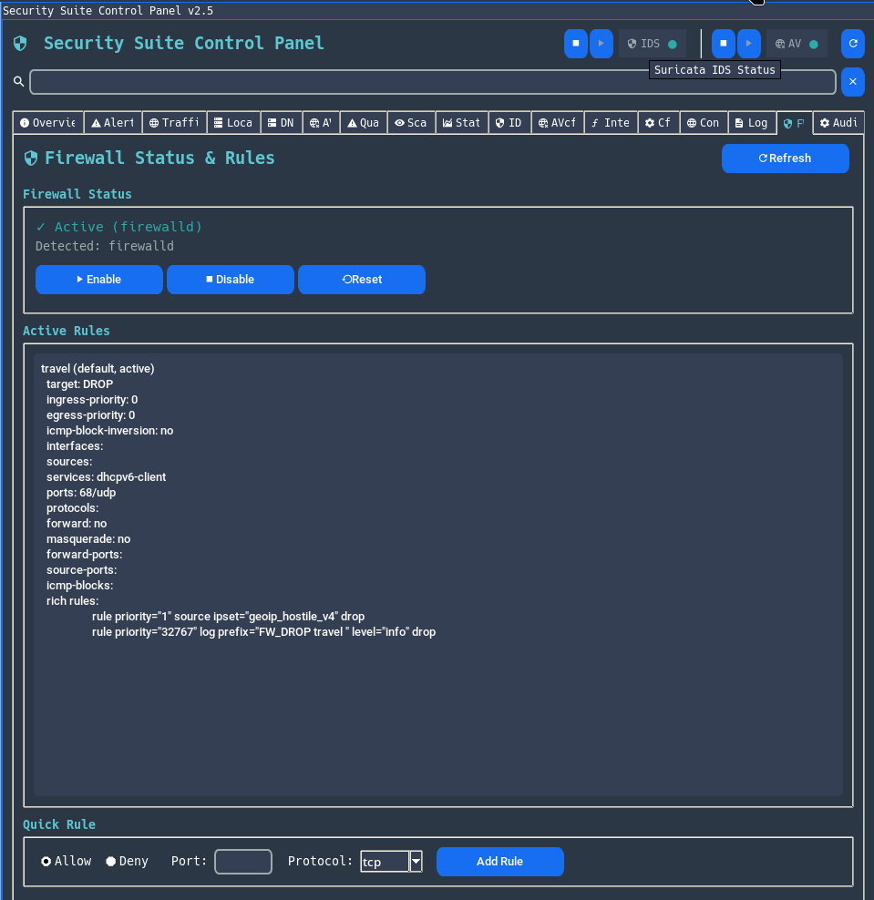
</p>

Integrated firewall control (firewalld/ufw):
- Status monitoring and enable/disable
- Active rule display with full details
- Quick rule creation (allow/deny by port/protocol)
- GeoIP blocking support
- Rich rule configuration

---

### Security Audit & Hardening

<p align="center">
  
</p>

System security assessment:
- **Security Score** — 0-100 rating with recommendations
- Firewall status verification
- SSH hardening checks (root login, password auth)
- SELinux/AppArmor status
- Automatic security updates configuration
- Fail2ban integration
- Disk encryption verification (LUKS)
- Audit logging status
- SUID binary auditing
- Secure kernel parameters

Each finding includes:
- Pass/fail status
- Remediation commands
- Configuration file locations
- Explanatory notes

---

### Configuration & Settings

<p align="center">
  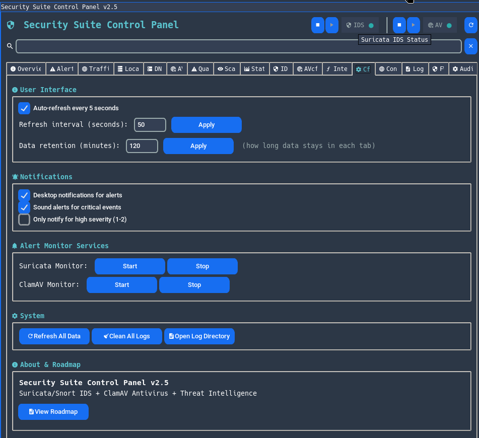
</p>

Customizable application settings:
- Auto-refresh intervals
- Data retention periods
- Desktop notifications with sound alerts
- Severity-based notification filtering
- Monitor service controls
- Log management utilities

---

## Installation

### Prerequisites

- **Python 3.8+**
- **Suricata** and/or **Snort** (IDS engines)
- **ClamAV** (antivirus)
- **firewalld** or **ufw** (firewall)
- **Tkinter** (usually included with Python)

### Quick Start

```bash
# Clone the repository
git clone https://github.com/jeremylaratro/lss.git
cd lss

# Install Python dependencies
pip install -r requirements.txt

# Run the application
python idsgui.py
```

### Fedora/RHEL

```bash
# Install IDS and AV
sudo dnf install suricata clamav clamav-update clamd

# Enable services
sudo systemctl enable --now suricata
sudo systemctl enable --now clamd@scan
```

### Debian/Ubuntu

```bash
# Install IDS and AV
sudo apt install suricata clamav clamav-daemon

# Enable services
sudo systemctl enable --now suricata
sudo systemctl enable --now clamav-daemon
```

---

## Usage

Launch the control panel:

```bash
./idsgui.py
```

Or:

```bash
python idsgui.py
```

The application will auto-detect installed services and display their status in the header bar.

### First-Time Setup

1. **Configure IDS** — Go to the IDS tab and select your network interface
2. **Enable Rules** — Enable recommended rule sources (ET Open is a good start)
3. **Setup Threat Intel** — Add API keys in the Intel tab for enhanced lookups
4. **Configure AV** — Enable on-access scanning for real-time protection
5. **Run Security Audit** — Check the Audit tab for hardening recommendations

---

## Threat Intelligence

The suite integrates with multiple threat intelligence providers:

| Provider | API Key Required | Features |
|----------|-----------------|----------|
| VirusTotal | Yes (free tier available) | IP/file reputation, detection ratios |
| AlienVault OTX | Yes (free) | Pulse-based IOCs, community intel |
| AbuseIPDB | Yes (free tier) | IP reputation, abuse confidence scores |
| ThreatFox | No | Malware IOCs, C2 infrastructure |

API keys are stored securely in your system's keyring.

---

## Project Structure

```
security-suite/
├── idsgui.py              # Application entry point
├── ids_suite/
│   ├── core/              # Core utilities
│   ├── engines/           # Suricata/Snort abstractions
│   ├── models/            # Data models (Alert, etc.)
│   ├── services/          # Service integrations
│   │   ├── clamav_service.py
│   │   ├── ids_service.py
│   │   ├── privilege_helper.py
│   │   └── systemd.py
│   ├── threat_intel/      # Threat intelligence clients
│   │   ├── virustotal.py
│   │   ├── abuseipdb.py
│   │   ├── otx.py
│   │   └── threatfox.py
│   └── ui/                # User interface
│       └── main_window.py
└── tests/                 # Test suite
```

---

## Configuration

Configuration files are stored in standard locations:

- **Suricata**: `/etc/suricata/suricata.yaml`
- **ClamAV**: `/etc/clamd.d/scan.conf`
- **Firewall**: Managed via firewalld/ufw APIs

Application settings are persisted in your local config directory.

---

## Contributing

Contributions are welcome! Please feel free to submit issues and pull requests.

1. Fork the repository
2. Create a feature branch (`git checkout -b feature/amazing-feature`)
3. Commit your changes (`git commit -m 'Add amazing feature'`)
4. Push to the branch (`git push origin feature/amazing-feature`)
5. Open a Pull Request

---

## License

This project is open source. See the LICENSE file for details.

---

## Acknowledgments

- [Suricata](https://suricata.io/) — High-performance IDS/IPS
- [ClamAV](https://www.clamav.net/) — Open source antivirus
- [Emerging Threats](https://rules.emergingthreats.net/) — IDS rule sets
- [abuse.ch](https://abuse.ch/) — Threat intelligence feeds
- [VirusTotal](https://www.virustotal.com/) — Multi-engine scanning
- [AlienVault OTX](https://otx.alienvault.com/) — Open threat exchange
- [AbuseIPDB](https://www.abuseipdb.com/) — IP reputation database

---

<p align="center">
  <sub>Built with Python and Tkinter</sub>
</p>
