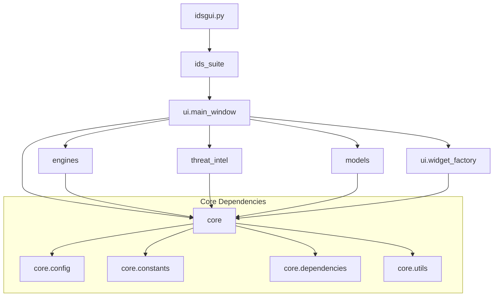

# IDS Suite Architecture

## System Overview

```
┌─────────────────────────────────────────────────────────────────────────────┐
│                           IDS Suite Control Panel                            │
├─────────────────────────────────────────────────────────────────────────────┤
│                                                                              │
│  ┌──────────────────────────────────────────────────────────────────────┐   │
│  │                          UI Layer (ui/)                              │   │
│  │  ┌─────────────────┐  ┌──────────────────────────────────────────┐   │   │
│  │  │  WidgetFactory  │  │       SecurityControlPanel               │   │   │
│  │  │  (CTk/ttk)      │  │  - Overview Tab    - Alerts Tab          │   │   │
│  │  └─────────────────┘  │  - Traffic Tab     - DNS Tab             │   │   │
│  │                       │  - ClamAV Tabs     - Analytics Tab       │   │   │
│  │                       │  - Settings Tabs   - Firewall Tab        │   │   │
│  │                       └──────────────────────────────────────────┘   │   │
│  └──────────────────────────────────────────────────────────────────────┘   │
│                                     │                                        │
│                                     ▼                                        │
│  ┌──────────────────────────────────────────────────────────────────────┐   │
│  │                       Service Layer (services/)                      │   │
│  │  ┌─────────────────┐  ┌─────────────────┐  ┌─────────────────────┐   │   │
│  │  │  SystemdService │  │   IDSService    │  │   ClamAVService     │   │   │
│  │  │  - start/stop   │  │  - start/stop   │  │  - daemon control   │   │   │
│  │  │  - is_active    │  │  - update_rules │  │  - scan management  │   │   │
│  │  │  - enable       │  │  - reload_rules │  │  - quarantine       │   │   │
│  │  └─────────────────┘  └─────────────────┘  └─────────────────────┘   │   │
│  └──────────────────────────────────────────────────────────────────────┘   │
│                                     │                                        │
│           ┌─────────────────────────┼─────────────────────────┐              │
│           ▼                         ▼                         ▼              │
│  ┌─────────────────┐  ┌─────────────────────────┐  ┌─────────────────────┐  │
│  │ Engines (engines/)│  │ Threat Intel (threat_intel/)│  │ Models (models/)   │  │
│  │ ┌─────────────┐ │  │ ┌───────────────────┐   │  │ ┌───────────────┐   │  │
│  │ │  IDSEngine  │ │  │ │ ThreatIntelCache  │   │  │ │    Alert      │   │  │
│  │ │  (Abstract) │ │  │ ├───────────────────┤   │  │ │  (dataclass)  │   │  │
│  │ ├─────────────┤ │  │ │ VirusTotalClient  │   │  │ └───────────────┘   │  │
│  │ │ Suricata    │ │  │ │ OTXClient         │   │  │ ┌───────────────┐   │  │
│  │ │ Engine      │ │  │ │ ThreatFoxClient   │   │  │ │ EVEFileReader │   │  │
│  │ ├─────────────┤ │  │ │ AbuseIPDBClient   │   │  │ │ (incremental) │   │  │
│  │ │ Snort       │ │  │ ├───────────────────┤   │  │ └───────────────┘   │  │
│  │ │ Engine      │ │  │ │ IPLookupTracker   │   │  │                     │  │
│  │ └─────────────┘ │  │ └───────────────────┘   │  │                     │  │
│  └─────────────────┘  └─────────────────────────┘  └─────────────────────┘  │
│                                     │                                        │
│                                     ▼                                        │
│  ┌──────────────────────────────────────────────────────────────────────┐   │
│  │                         Core Layer (core/)                           │   │
│  │  ┌─────────────────┐  ┌─────────────────┐  ┌─────────────────────┐   │   │
│  │  │     Config      │  │    Constants    │  │   Dependencies      │   │   │
│  │  │  (Singleton)    │  │  Colors, Paths  │  │   CTK, matplotlib   │   │   │
│  │  │  settings.json  │  │  Timeouts       │  │   keyring, requests │   │   │
│  │  └─────────────────┘  └─────────────────┘  └─────────────────────┘   │   │
│  │  ┌─────────────────┐                                                 │   │
│  │  │     Utils       │                                                 │   │
│  │  │  is_private_ip  │                                                 │   │
│  │  └─────────────────┘                                                 │   │
│  └──────────────────────────────────────────────────────────────────────┘   │
│                                                                              │
└─────────────────────────────────────────────────────────────────────────────┘
                                      │
                                      ▼
┌─────────────────────────────────────────────────────────────────────────────┐
│                            External Systems                                  │
├─────────────────────────────────────────────────────────────────────────────┤
│  ┌───────────────┐  ┌───────────────┐  ┌───────────────┐  ┌─────────────┐   │
│  │   Suricata    │  │    Snort 3    │  │    ClamAV     │  │   systemd   │   │
│  │  eve.json     │  │ alert_json    │  │   clamd       │  │  services   │   │
│  └───────────────┘  └───────────────┘  └───────────────┘  └─────────────┘   │
│                                                                              │
│  ┌───────────────┐  ┌───────────────┐  ┌───────────────┐  ┌─────────────┐   │
│  │  VirusTotal   │  │  AlienVault   │  │  ThreatFox    │  │  AbuseIPDB  │   │
│  │     API       │  │   OTX API     │  │     API       │  │     API     │   │
│  └───────────────┘  └───────────────┘  └───────────────┘  └─────────────┘   │
└─────────────────────────────────────────────────────────────────────────────┘
```

## Design Patterns

### 1. Strategy Pattern (IDS Engines)

The `IDSEngine` abstract base class defines the interface for IDS engines, allowing Suricata and Snort to be used interchangeably:

```python
from abc import ABC, abstractmethod

class IDSEngine(ABC):
    @abstractmethod
    def get_name(self) -> str: pass
    @abstractmethod
    def parse_alert(self, line: str) -> dict: pass
    # ... other abstract methods

class SuricataEngine(IDSEngine):
    def get_name(self) -> str:
        return "Suricata"
    # ... implementation

class SnortEngine(IDSEngine):
    def get_name(self) -> str:
        return "Snort"
    # ... implementation
```

### 2. Factory Pattern (Widget Factory)

`WidgetFactory` abstracts widget creation, enabling seamless switching between CustomTkinter and ttk:

```python
class WidgetFactory:
    def __init__(self, colors: dict):
        self.use_ctk = CTK_AVAILABLE

    def create_button(self, parent, text, command=None):
        if self.use_ctk:
            return ctk.CTkButton(parent, text=text, command=command)
        return ttk.Button(parent, text=text, command=command)
```

### 3. Singleton Pattern (Config)

The `Config` class ensures a single configuration instance across the application:

```python
class Config:
    _instance = None

    def __new__(cls):
        if cls._instance is None:
            cls._instance = super().__new__(cls)
            cls._instance._load_settings()
        return cls._instance
```

### 4. Template Method Pattern (Threat Intel Clients)

Each threat intelligence client follows a common structure while implementing provider-specific logic:

```python
class ThreatIntelClient:
    def __init__(self, api_key):
        self.api_key = api_key
        self.cache = ThreatIntelCache()

    def lookup_ip(self, ip: str) -> dict:
        cached = self.cache.get(f"ip:{ip}")
        if cached:
            return cached
        result = self._make_request(...)  # Provider-specific
        self.cache.set(f"ip:{ip}", result)
        return result
```

## Data Flow

### Alert Processing Pipeline

```
EVE JSON Log File
       │
       ▼
┌──────────────────┐
│  EVEFileReader   │  ◄── Incremental reading with rotation detection
│  - read_new_lines│
│  - initial_load  │
└────────┬─────────┘
         │
         ▼
┌──────────────────┐
│   IDSEngine      │  ◄── Suricata or Snort parser
│  - parse_alert   │
└────────┬─────────┘
         │
         ▼
┌──────────────────┐
│     Alert        │  ◄── Structured data class
│   (dataclass)    │
└────────┬─────────┘
         │
         ▼
┌──────────────────┐
│ SecurityControl  │  ◄── Filter, display, export
│    Panel         │
└──────────────────┘
```

### Service Control Flow

```
User Action (Start IDS)
         │
         ▼
┌──────────────────┐
│   IDSService     │
│  - start()       │
└────────┬─────────┘
         │
         ▼
┌──────────────────┐
│ SystemdService   │
│  - pkexec        │
└────────┬─────────┘
         │
         ▼
┌──────────────────┐
│    systemctl     │
│  start suricata  │
└────────┬─────────┘
         │
         ▼
┌──────────────────┐
│  ServiceResult   │  ◄── success, message, returncode
└──────────────────┘
```

## Module Dependencies



## Threading Model

The application uses threading for non-blocking operations:

- **Service Control**: Start/stop operations run in daemon threads
- **Threat Intel Lookups**: API calls are made asynchronously
- **File Scanning**: ClamAV scans run in background threads
- **Auto-Refresh**: Periodic updates via `root.after()` callbacks

```python
def start_ids(self):
    def do_start():
        result = subprocess.run("pkexec systemctl start suricata-laptop", ...)
        self.root.after(100, self.refresh_status)  # UI update on main thread

    threading.Thread(target=do_start, daemon=True).start()
```

## Configuration Storage

```
~/.config/security-suite/
├── settings.json       # Application settings
└── ip_lookups.json     # IP lookup history (3-day window)

System Keyring:
├── security-suite/virustotal   # VirusTotal API key
├── security-suite/otx          # AlienVault OTX API key
└── security-suite/abuseipdb    # AbuseIPDB API key
```
